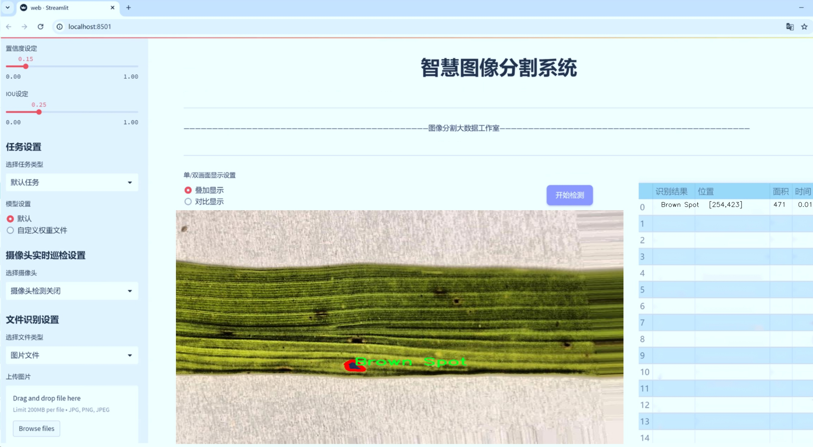
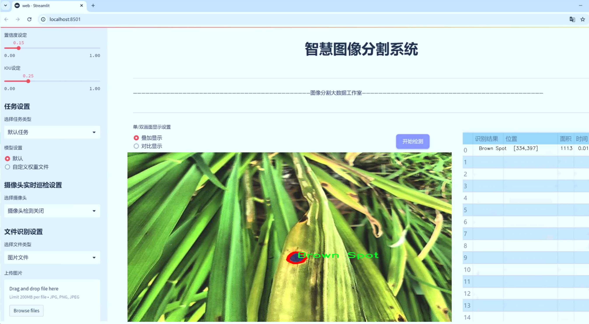
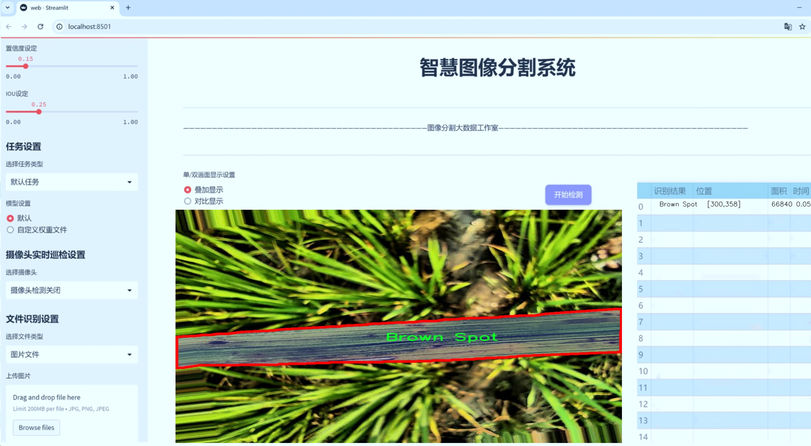
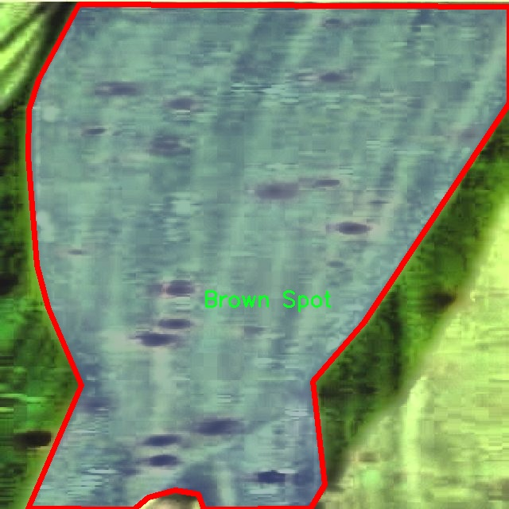
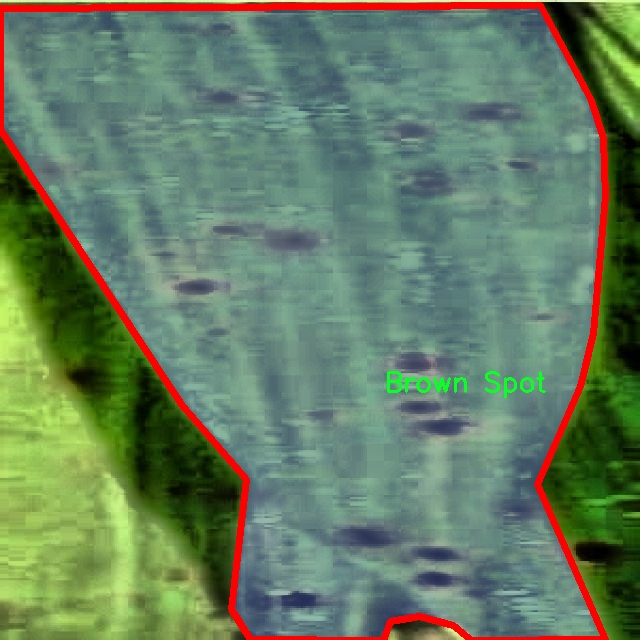
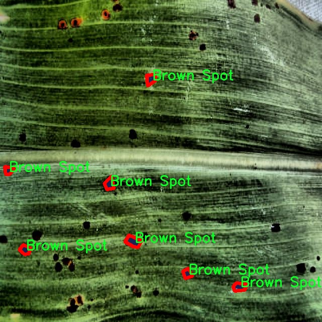
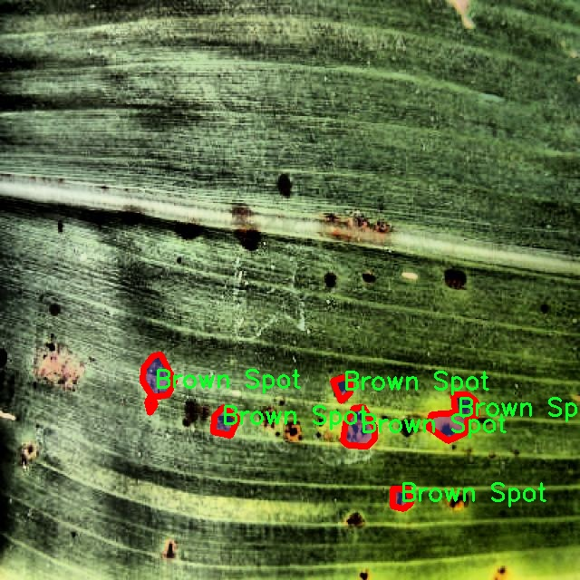
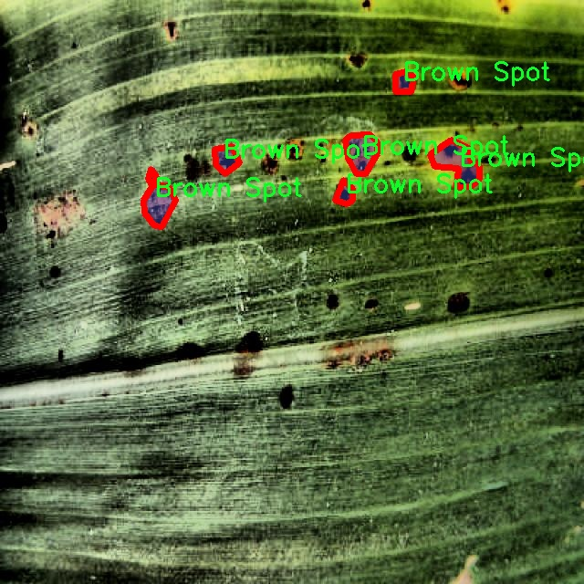

# 水稻叶片病害图像分割系统： yolov8-seg-EfficientFormerV2

### 1.研究背景与意义

[参考博客](https://gitee.com/YOLOv8_YOLOv11_Segmentation_Studio/projects)

[博客来源](https://kdocs.cn/l/cszuIiCKVNis)

研究背景与意义

随着全球人口的不断增长，粮食安全问题日益凸显，水稻作为世界上最重要的粮食作物之一，其产量和质量直接关系到数亿人的生存与发展。然而，水稻在生长过程中常常受到各种病害的侵袭，严重影响了水稻的产量和品质。根据统计，水稻病害每年造成的损失高达数十亿美元。因此，及时、准确地识别和处理水稻病害，成为了农业生产中亟待解决的关键问题之一。

近年来，计算机视觉技术的快速发展为农业病害的检测与识别提供了新的解决方案。特别是深度学习技术的引入，使得图像分割和目标检测的精度大幅提升。YOLO（You Only Look Once）系列模型因其高效的实时检测能力，逐渐成为图像识别领域的主流方法。YOLOv8作为该系列的最新版本，具备更强的特征提取能力和更快的处理速度，为水稻病害的图像分割提供了良好的技术基础。

本研究旨在基于改进的YOLOv8模型，构建一个高效的水稻叶片病害图像分割系统。该系统将利用2900张经过标注的水稻叶片图像，涵盖了五种主要病害类别：褐斑病、健康叶片、稻飞虱、 sheath blight（鞘腐病）和Tungro（稻瘟病）。通过对这些图像的深入分析与处理，期望能够实现对水稻病害的精准识别与分割，为农业生产提供科学依据。

本研究的意义不仅在于技术层面的创新，更在于其对农业生产实践的推动作用。通过构建一个高效的病害识别系统，农民可以在早期阶段及时发现病害，采取相应的防治措施，从而减少病害对水稻产量的影响。此外，该系统的应用还将为农业管理者提供数据支持，帮助其制定更为科学的病害防治策略，提高水稻的整体生产效率。

同时，随着数据集的不断扩展和模型的持续优化，本研究还将为后续的相关研究提供基础数据和技术支持。未来，基于深度学习的图像分割技术有望推广到其他农作物的病害检测中，形成一个更加全面的农业智能管理体系。这不仅能够提升农业生产的智能化水平，还将为实现可持续农业发展贡献力量。

综上所述，基于改进YOLOv8的水稻叶片病害图像分割系统的研究，不仅具有重要的理论价值，也具有广泛的实际应用前景。通过这一研究，我们希望能够为水稻病害的精准识别提供有效的技术手段，为保障粮食安全、促进农业可持续发展做出积极贡献。

### 2.图片演示







注意：本项目提供完整的训练源码数据集和训练教程,由于此博客编辑较早,暂不提供权重文件（best.pt）,需要按照6.训练教程进行训练后实现上图效果。

### 3.视频演示

[3.1 视频演示](https://www.bilibili.com/video/BV1iDmXYiErq/)

### 4.数据集信息

##### 4.1 数据集类别数＆类别名

nc: 5
names: ['Brown Spot', 'Healthy', 'Hispa', 'Sheath Blight', 'Tungro']


##### 4.2 数据集信息简介

数据集信息展示

在本研究中，我们采用了名为“RiceLeafDiseaseSegmentation”的数据集，以训练和改进YOLOv8-seg模型，旨在实现对水稻叶片病害的高效图像分割。该数据集专门针对水稻叶片的不同病害进行了精心标注，包含了五个主要类别，分别是“Brown Spot”（褐斑病）、“Healthy”（健康叶片）、“Hispa”（水稻叶蝉）、“Sheath Blight”（ sheath blight）和“Tungro”（稻瘟病）。这些类别不仅涵盖了水稻叶片的健康状态，还详细描绘了常见病害的特征，使得模型在训练过程中能够学习到丰富的视觉信息。

数据集的构建过程涉及了大量的图像采集和标注工作。研究人员在不同的生长阶段和环境条件下，收集了多样化的水稻叶片图像，确保数据集的代表性和多样性。每个类别的图像数量均衡，保证了模型在训练时不会偏向某一特定类别，从而提高了分割的准确性和鲁棒性。数据集中包含的图像不仅有不同的光照条件、拍摄角度和背景环境，还涵盖了不同品种的水稻，进一步增强了模型的泛化能力。

在数据预处理阶段，我们对图像进行了标准化处理，包括调整图像大小、增强对比度和应用数据增强技术，以增加训练样本的多样性。这些处理措施旨在提升模型对水稻叶片病害的识别能力，使其能够在实际应用中更好地适应不同的场景和条件。此外，为了确保模型的训练效果，我们将数据集划分为训练集、验证集和测试集，确保每个子集都能代表整体数据的特征。

在训练过程中，YOLOv8-seg模型通过学习数据集中不同类别的特征，逐步提高了对水稻叶片病害的分割精度。模型不仅能够准确识别出健康叶片，还能有效区分出各种病害的特征区域。这一过程的成功依赖于数据集的高质量标注和丰富的样本多样性，使得模型在面对实际应用时，能够快速而准确地进行病害检测和分类。

随着水稻种植技术的不断发展，病害的监测和管理变得愈发重要。通过对“RiceLeafDiseaseSegmentation”数据集的深入研究，我们不仅为水稻病害的自动检测提供了强有力的支持，也为今后相关领域的研究奠定了基础。未来，我们希望通过不断优化模型和扩展数据集，进一步提升水稻病害图像分割系统的性能，为农业生产提供更为精准的技术支持，助力实现智能农业的目标。











### 5.项目依赖环境部署教程（零基础手把手教学）

[5.1 环境部署教程链接（零基础手把手教学）](https://www.bilibili.com/video/BV1jG4Ve4E9t/?vd_source=bc9aec86d164b67a7004b996143742dc)


[5.2 安装Python虚拟环境创建和依赖库安装视频教程链接（零基础手把手教学）](https://www.bilibili.com/video/BV1nA4VeYEze/?vd_source=bc9aec86d164b67a7004b996143742dc)

### 6.手把手YOLOV8-seg训练视频教程（零基础手把手教学）

[6.1 手把手YOLOV8-seg训练视频教程（零基础小白有手就能学会）](https://www.bilibili.com/video/BV1cA4VeYETe/?vd_source=bc9aec86d164b67a7004b996143742dc)


按照上面的训练视频教程链接加载项目提供的数据集，运行train.py即可开始训练



     Epoch   gpu_mem       box       obj       cls    labels  img_size
     1/200     0G   0.01576   0.01955  0.007536        22      1280: 100%|██████████| 849/849 [14:42<00:00,  1.04s/it]
               Class     Images     Labels          P          R     mAP@.5 mAP@.5:.95: 100%|██████████| 213/213 [01:14<00:00,  2.87it/s]
                 all       3395      17314      0.994      0.957      0.0957      0.0843

     Epoch   gpu_mem       box       obj       cls    labels  img_size
     2/200     0G   0.01578   0.01923  0.007006        22      1280: 100%|██████████| 849/849 [14:44<00:00,  1.04s/it]
               Class     Images     Labels          P          R     mAP@.5 mAP@.5:.95: 100%|██████████| 213/213 [01:12<00:00,  2.95it/s]
                 all       3395      17314      0.996      0.956      0.0957      0.0845

     Epoch   gpu_mem       box       obj       cls    labels  img_size
     3/200     0G   0.01561    0.0191  0.006895        27      1280: 100%|██████████| 849/849 [10:56<00:00,  1.29it/s]
               Class     Images     Labels          P          R     mAP@.5 mAP@.5:.95: 100%|███████   | 187/213 [00:52<00:00,  4.04it/s]
                 all       3395      17314      0.996      0.957      0.0957      0.0845


### 7.50+种全套YOLOV8-seg创新点加载调参实验视频教程（一键加载写好的改进模型的配置文件）

[7.1 50+种全套YOLOV8-seg创新点加载调参实验视频教程（一键加载写好的改进模型的配置文件）](https://www.bilibili.com/video/BV1Hw4VePEXv/?vd_source=bc9aec86d164b67a7004b996143742dc)

### YOLOV8-seg算法简介

原始YOLOv8-seg算法原理

YOLOv8-seg算法是Ultralytics公司在2023年推出的一个重要更新版本，旨在提升目标检测和图像分割的性能。该算法在YOLO系列的基础上，结合了最新的深度学习技术和结构设计，形成了一种高效、准确且易于使用的解决方案。YOLOv8-seg不仅适用于目标检测，还能够实现精细的图像分割任务，展现出极高的灵活性和适应性。

首先，YOLOv8-seg算法的网络结构分为三个主要部分：输入端（Input）、主干网络（Backbone）和检测端（Head）。在输入端，YOLOv8-seg默认接受640x640的图像尺寸，然而为了适应不同长宽比的图像，算法采用自适应缩放策略。该策略通过将图像的长边缩放至指定尺寸，然后对短边进行填充，旨在最大限度地减少信息冗余，提升目标检测和推理的速度。此外，YOLOv8-seg在训练过程中引入了Mosaic数据增强技术，该技术通过随机拼接四张不同的图像，迫使模型学习不同位置和周围像素的特征，从而有效提高了模型的鲁棒性和预测精度。

在主干网络部分，YOLOv8-seg引入了C2f模块，取代了YOLOv5中的C3模块。C2f模块结合了ELAN模块的设计思想，增加了更多的残差连接，确保在轻量化的基础上，模型能够获得更丰富的梯度信息。这种设计使得YOLOv8-seg在特征提取的过程中，不仅能够保持高效的计算性能，还能显著提升检测精度。主干网络的改进使得YOLOv8-seg在处理复杂场景时，能够更好地捕捉目标的细节信息。

在Neck部分，YOLOv8-seg对特征融合的方式进行了优化，去除了多余的卷积层，直接对主干网络不同阶段输出的特征进行上采样。这种简化的结构不仅减少了计算复杂度，还提高了特征的传递效率，使得后续的检测和分割任务能够更快地进行。

YOLOv8-seg在Head部分的创新尤为显著。它采用了解耦合头结构，将分类和检测任务分开处理。与传统的耦合头结构不同，YOLOv8-seg的解耦合头结构通过两个独立的卷积模块，分别进行类别预测和边界框回归。这种设计不仅提高了模型的灵活性，还解决了在训练和推理过程中可能出现的逻辑不一致性问题。此外，YOLOv8-seg抛弃了传统的Anchor-Based方法，转而采用Anchor-Free的关键点检测方式。这一转变使得模型在处理不同尺度和长宽比的目标时，具有更强的泛化能力和适应性，简化了模型的设计。

在损失函数的设计上，YOLOv8-seg使用了BCELoss作为分类损失，DFLLoss和CIoULoss作为回归损失。这种组合损失函数的选择，旨在使模型在训练过程中更快地聚焦于标签附近的数值，从而提高目标检测和分割的精度。

YOLOv8-seg算法的创新之处不仅体现在结构和损失函数的设计上，还在于其在训练过程中的数据增强策略。通过在训练的最后10个epoch关闭Mosaic增强，YOLOv8-seg能够在模型收敛的过程中，保持较高的稳定性和准确性。这种策略的实施，确保了模型在面对真实世界中的复杂场景时，依然能够保持优异的性能。

总的来说，YOLOv8-seg算法在目标检测和图像分割领域的应用潜力巨大。其通过一系列的结构优化和创新设计，提升了模型的准确性和计算效率，使其成为当前最先进的目标检测算法之一。无论是在智能监控、自动驾驶还是人脸识别等应用场景中，YOLOv8-seg都展现出了卓越的性能，成为研究者和工程师们在实际应用中首选的工具。通过对YOLOv8-seg算法的深入理解，可以为后续的研究和应用提供坚实的理论基础和实践指导。


### 9.系统功能展示（检测对象为举例，实际内容以本项目数据集为准）

图9.1.系统支持检测结果表格显示

  图9.2.系统支持置信度和IOU阈值手动调节

  图9.3.系统支持自定义加载权重文件best.pt(需要你通过步骤5中训练获得)

  图9.4.系统支持摄像头实时识别

  图9.5.系统支持图片识别

  图9.6.系统支持视频识别

  图9.7.系统支持识别结果文件自动保存

  图9.8.系统支持Excel导出检测结果数据


### 10.50+种全套YOLOV8-seg创新点原理讲解（非科班也可以轻松写刊发刊，V11版本正在科研待更新）

#### 10.1 由于篇幅限制，每个创新点的具体原理讲解就不一一展开，具体见下列网址中的创新点对应子项目的技术原理博客网址【Blog】：


[10.1 50+种全套YOLOV8-seg创新点原理讲解链接](https://gitee.com/qunmasj/good)

#### 10.2 部分改进模块原理讲解(完整的改进原理见上图和技术博客链接)【如果此小节的图加载失败可以通过CSDN或者Github搜索该博客的标题访问原始博客，原始博客图片显示正常】
### YOLOv8简介
YOLOv8目标检测算法继承了YOLOv1 系列的思考,是一种新型端到端的目标检测算法,尽管现在原始检测算法已经开源,但是鲜有发表的相关论文.YOLOv8的网络结构如图1[1所示,主要可分为Input输入端、Backbone 骨干神经网络、Neck混合特征网络层和 Head预测层网络共4个部分.

输入端( input)方法包含的功能模块有:马赛克( mosaic)数据增强、自适应锚框( anchor)计算、自适应图片缩放和 Mixup 数据增强['6].马赛克数据增强包括3种方式:缩放,色彩空间调整和马赛克增强.
该方法通过将4张图像进行随机的缩放﹑裁剪和打乱分布方式等操作来重新拼接图像,可丰富检测的数据集,具体步骤可见图2.随机缩放增加的许多小目标,非常适于解决卫星数据往往因距离目标过远从而导致图像中几乎都是小目标这一问题.在自适应锚框计算中, YOLO算法在每次训练数据之前,都会根据标注信息自动计算该数据集最合适的锚框尺寸,然后自动匹配最佳锚框.而自适应图片缩放只在检测时使用,由于不同场景需求不同,因而基于缩放系数YOLOv8提供了多尺度的不同大小模型.Mixup 数据增强鼓励模型对训练样本有一个线性的理解,具体做法是在目标检测中将两幅图像的像素值按照图像透明度的通道信息( alpha值)进行线性融合,对于标签box的处理直接采用拼接( con-cat)的方法拼接到一起.


Backbone骨干网络指用来提取图像特征的网络,整体结构包括注意力机制( focus)模块、跨阶段局部网络[ 7] ( cross stage partial network , CSP)和空间金字塔池化结构( spatial pyramid pooling,SPP).其中, Focus模块的作用是在图片进入 Backbone骨干网络前,对图片进行切片操作,即在一张图片中每隔一个像素取一个值,获得4张互补的图片,最后将新生成的图片经过卷积操作,得到没有信息丢失的2倍下采样特征图.YOLOv8使用了CSPNet 中的C2f网络,网络见图3,其中 CBS 就是卷积层,而瓶颈层( bottleneck layer)使用的是1* 1的卷积神经网络.C2f网络在保证轻量化的同时获得更加丰富的梯度流信息.而SPP结构是空间金字塔池化,能将任意大小的特征图转换成固定大小的特征向量,即把输入的特征地图划分为多个尺度,然后对每个图进行最大池化,再将提取的特征值拼接起来成为一维向量,输入SPP层获取分类.


Neck 结构如图4所示,它是由卷积层和C2f模块组成的的网络层,采用了路径聚合网络( path ag-gregation network ,PAN)和特征金字塔网络( featurepyramid networks , FPN)的结构对特征进行多尺度融合,目标是将图像特征传递到预测层.其中 PAN结构指图4左半边,它自底向上进行下采样,使顶层特征包含图像位置信息,两个特征最后进行融合,使不同尺寸的特征图都包含图像语义信息和图像特征信息，保证了网络对不同尺寸的图片的准确预测.而FPN结构指图4右半边,指通过自顶向下进行上采样,将高层特征与底层特征进行融合,从而同时利用低层特征的高分辨率和高层特征的丰富语义信息,并进行了多尺度特征的独立预测,对小物体的检测效果有明显的提升.从 FPN模块的基础上看,它增加了自底向上的特征金字塔结构,保留了更多的浅层位置特征,将整体特征提取能力进一步提升.


Head的结构如图5所示,在该结构中 YOLOv8采用了解耦检测头( decoupled-head )[ 18],因为分类和定位的关注点不同,分类更关注目标的纹理内容而定位更关注目标的边缘信息.因而解耦头结构考虑到分类和定位所关注的内容的不同,采用不同的分支来进行运算,提升了检测效果,相对应的回归头的通道数也改变了.


### MS-Block简介
实时目标检测，以YOLO系列为例，已在工业领域中找到重要应用，特别是在边缘设备（如无人机和机器人）中。与之前的目标检测器不同，实时目标检测器旨在在速度和准确性之间追求最佳平衡。为了实现这一目标，提出了大量的工作：从第一代DarkNet到CSPNet，再到最近的扩展ELAN，随着性能的快速增长，实时目标检测器的架构经历了巨大的变化。

尽管性能令人印象深刻，但在不同尺度上识别对象仍然是实时目标检测器面临的基本挑战。这促使作者设计了一个强大的编码器架构，用于学习具有表现力的多尺度特征表示。具体而言，作者从两个新的角度考虑为实时目标检测编码多尺度特征：

从局部视角出发，作者设计了一个具有简单而有效的分层特征融合策略的MS-Block。受到Res2Net的启发，作者在MS-Block中引入了多个分支来进行特征提取，但不同的是，作者使用了一个带有深度卷积的 Inverted Bottleneck Block块，以实现对大Kernel的高效利用。

从全局视角出发，作者提出随着网络加深逐渐增加卷积的Kernel-Size。作者在浅层使用小Kernel卷积来更高效地处理高分辨率特征。另一方面，在深层中，作者采用大Kernel卷积来捕捉广泛的信息。

基于以上设计原则，作者呈现了作者的实时目标检测器，称为YOLO-MS。为了评估作者的YOLO-MS的性能，作者在MS COCO数据集上进行了全面的实验。还提供了与其他最先进方法的定量比较，以展示作者方法的强大性能。如图1所示，YOLO-MS在计算性能平衡方面优于其他近期的实时目标检测器。


具体而言，YOLO-MS-XS在MS COCO上获得了43%+的AP得分，仅具有450万个可学习参数和8.7亿个FLOPs。YOLO-MS-S和YOLO-MS分别获得了46%+和51%+的AP，可学习参数分别为810万和2220万。此外，作者的工作还可以作为其他YOLO模型的即插即用模块。通常情况下，作者的方法可以将YOLOv8的AP从37%+显著提高到40%+，甚至还可以使用更少的参数和FLOPs。

CSP Block是一个基于阶段级梯度路径的网络，平衡了梯度组合和计算成本。它是广泛应用于YOLO系列的基本构建块。已经提出了几种变体，包括YOLOv4和YOLOv5中的原始版本，Scaled YOLOv4中的CSPVoVNet，YOLOv7中的ELAN，以及RTMDet中提出的大Kernel单元。作者在图2(a)和图2(b)中分别展示了原始CSP块和ELAN的结构。


上述实时检测器中被忽视的一个关键方面是如何在基本构建块中编码多尺度特征。其中一个强大的设计原则是Res2Net，它聚合了来自不同层次的特征以增强多尺度表示。然而，这一原则并没有充分探索大Kernel卷积的作用，而大Kernel卷积已经在基于CNN的视觉识别任务模型中证明有效。将大Kernel卷积纳入Res2Net的主要障碍在于它们引入的计算开销，因为构建块采用了标准卷积。在作者的方法中，作者提出用 Inverted Bottleneck Block替代标准的3 × 3卷积，以享受大Kernel卷积的好处。

#### MS-Block

基于前面的分析，参考该博客提出了一个带有分层特征融合策略的全新Block，称为MS-Block，以增强实时目标检测器在提取多尺度特征时的能力，同时保持快速的推理速度。

MS-Block的具体结构如图2(c)所示。假设是输入特征。通过1×1卷积的转换后，X的通道维度增加到n*C。然后，作者将X分割成n个不同的组，表示为，其中。为了降低计算成本，作者选择n为3。

注意，除了之外，每个其他组都经过一个 Inverted Bottleneck Block层，用表示，其中k表示Kernel-Size，以获得。的数学表示如下：


根据这个公式，作者不将 Inverted Bottleneck Block层连接到，使其作为跨阶段连接，并保留来自前面层的信息。最后，作者将所有分割连接在一起，并应用1×1卷积来在所有分割之间进行交互，每个分割都编码不同尺度的特征。当网络加深时，这个1×1卷积也用于调整通道数。

#### Heterogeneous Kernel Selection Protocol
除了构建块的设计外，作者还从宏观角度探讨了卷积的使用。之前的实时目标检测器在不同的编码器阶段采用了同质卷积（即具有相同Kernel-Size的卷积），但作者认为这不是提取多尺度语义信息的最佳选项。

在金字塔结构中，从检测器的浅阶段提取的高分辨率特征通常用于捕捉细粒度语义，将用于检测小目标。相反，来自网络较深阶段的低分辨率特征用于捕捉高级语义，将用于检测大目标。如果作者在所有阶段都采用统一的小Kernel卷积，深阶段的有效感受野（ERF）将受到限制，影响大目标的性能。在每个阶段中引入大Kernel卷积可以帮助解决这个问题。然而，具有大的ERF的大Kernel可以编码更广泛的区域，这增加了在小目标外部包含噪声信息的概率，并且降低了推理速度。

在这项工作中，作者建议在不同阶段中采用异构卷积，以帮助捕获更丰富的多尺度特征。具体来说，在编码器的第一个阶段中，作者采用最小Kernel卷积，而最大Kernel卷积位于最后一个阶段。随后，作者逐步增加中间阶段的Kernel-Size，使其与特征分辨率的增加保持一致。这种策略允许提取细粒度和粗粒度的语义信息，增强了编码器的多尺度特征表示能力。

正如图所示，作者将k的值分别分配给编码器中的浅阶段到深阶段，取值为3、5、7和9。作者将其称为异构Kernel选择（HKS）协议。


作者的HKS协议能够在深层中扩大感受野，而不会对浅层产生任何其他影响。第4节的图4支持了作者的分析。此外，HKS不仅有助于编码更丰富的多尺度特征，还确保了高效的推理。

如表1所示，将大Kernel卷积应用于高分辨率特征会产生较高的计算开销。然而，作者的HKS协议在低分辨率特征上采用大Kernel卷积，从而与仅使用大Kernel卷积相比，大大降低了计算成本。


在实践中，作者经验性地发现，采用HKS协议的YOLO-MS的推理速度几乎与仅使用深度可分离的3 × 3卷积相同。


如图所示，作者模型的Backbone由4个阶段组成，每个阶段后面跟随1个步长为2的3 × 3卷积进行下采样。在第3个阶段后，作者添加了1个SPP块，与RTMDet中一样。在作者的编码器上，作者使用PAFPN作为Neck来构建特征金字塔[31, 35]。它融合了从Backbone不同阶段提取的多尺度特征。Neck中使用的基本构建块也是作者的MS-Block，在其中使用3 × 3深度可分离卷积进行快速推理。

此外，为了在速度和准确性之间取得更好的平衡，作者将Backbone中多级特征的通道深度减半。作者提供了3个不同尺度的YOLO-MS变体，即YOLO-MS-XS、YOLO-MS-S和YOLO-MS。不同尺度的YOLO-MS的详细配置列在表2中。对于YOLO-MS的其他部分，作者将其保持与RTMDet相同。


### 11.项目核心源码讲解（再也不用担心看不懂代码逻辑）

#### 11.1 ultralytics\models\sam\__init__.py

下面是对提供的代码进行逐行分析和核心部分保留的结果，并附上详细的中文注释：

```python
# Ultralytics YOLO 🚀, AGPL-3.0 license

# 从当前包中导入SAM模型
from .model import SAM

# 从当前包中导入预测器Predictor
from .predict import Predictor

# 定义模块的公开接口，指定可以被外部访问的类或函数
__all__ = 'SAM', 'Predictor'  # 公开的接口包含SAM和Predictor
```

### 代码分析与注释：

1. **导入模块**：
   - `from .model import SAM`：从当前包的`model`模块中导入`SAM`类。`SAM`可能是一个深度学习模型，用于目标检测或其他计算机视觉任务。
   - `from .predict import Predictor`：从当前包的`predict`模块中导入`Predictor`类。`Predictor`通常用于执行模型的推理或预测。

2. **定义公开接口**：
   - `__all__ = 'SAM', 'Predictor'`：这是一个特殊的变量，用于定义当使用`from module import *`语句时，哪些名称会被导入。这里指定了`SAM`和`Predictor`两个类，使得它们可以被外部模块访问。

### 核心部分总结：
- 该代码的核心在于导入模型和预测器，并定义了模块的公开接口，确保用户可以方便地使用这些功能。

这个文件是Ultralytics YOLO项目中的一个模块初始化文件，位于`ultralytics/models/sam`目录下。文件的主要功能是导入该模块中的核心类和功能，并定义模块的公共接口。

首先，文件的开头有一行注释，表明该项目使用的是AGPL-3.0许可证，并且是Ultralytics YOLO项目的一部分。接着，文件通过相对导入的方式引入了两个重要的组件：`SAM`和`Predictor`。`SAM`通常代表某种模型或算法，而`Predictor`则可能是用于进行预测的类或函数。

最后，`__all__`变量被定义为一个元组，包含了`SAM`和`Predictor`。这个变量的作用是控制当使用`from module import *`语句时，哪些名称会被导入。通过定义`__all__`，开发者可以明确指出模块的公共接口，帮助用户了解可以使用哪些功能。

总体而言，这个文件是一个简单而重要的模块初始化文件，它为使用者提供了清晰的接口，并确保了模块的可用性和可维护性。

#### 11.2 ultralytics\models\yolo\classify\__init__.py

```python
# 导入Ultralytics YOLO模型的分类模块
# 该模块包含了用于图像分类的预测、训练和验证功能

# 从ultralytics.models.yolo.classify.predict导入分类预测器
from ultralytics.models.yolo.classify.predict import ClassificationPredictor

# 从ultralytics.models.yolo.classify.train导入分类训练器
from ultralytics.models.yolo.classify.train import ClassificationTrainer

# 从ultralytics.models.yolo.classify.val导入分类验证器
from ultralytics.models.yolo.classify.val import ClassificationValidator

# 定义模块的公开接口，包含分类预测器、训练器和验证器
__all__ = 'ClassificationPredictor', 'ClassificationTrainer', 'ClassificationValidator'
```

### 代码核心部分及注释说明：

1. **导入模块**：
   - `ClassificationPredictor`：用于图像分类的预测功能，能够对输入的图像进行分类并返回预测结果。
   - `ClassificationTrainer`：用于训练分类模型的功能，提供训练过程中的各种设置和方法。
   - `ClassificationValidator`：用于验证分类模型的功能，能够评估模型在验证集上的表现。

2. **公开接口**：
   - `__all__`：定义了当使用 `from module import *` 时，哪些名称会被导入。这里列出了三个核心类，确保使用者能够方便地访问这些功能。

这个程序文件是Ultralytics YOLO项目中的一个模块，主要用于分类任务。文件的开头包含了版权信息，表明该代码遵循AGPL-3.0许可证。接下来，文件通过`from`语句导入了三个类：`ClassificationPredictor`、`ClassificationTrainer`和`ClassificationValidator`。这些类分别用于分类模型的预测、训练和验证。

`ClassificationPredictor`类负责处理模型的预测功能，允许用户输入数据并获得分类结果。`ClassificationTrainer`类则用于训练分类模型，提供了训练过程中的各种功能和参数设置。最后，`ClassificationValidator`类用于验证训练好的模型的性能，确保模型在未见数据上的表现。

文件的最后一行定义了`__all__`，这是一个特殊的变量，用于控制从模块中导入的内容。当使用`from module import *`语句时，只有在`__all__`中列出的名称会被导入，这样可以避免不必要的名称污染，确保只导入重要的类和函数。

总的来说，这个文件是Ultralytics YOLO分类模块的入口，整合了分类相关的主要功能，方便用户进行模型的训练、预测和验证。

#### 11.3 ultralytics\models\sam\modules\encoders.py

以下是经过简化和注释的核心代码部分，主要包括 `ImageEncoderViT` 类及其关键组件。

```python
import torch
import torch.nn as nn
from typing import Optional, Tuple, Type

class ImageEncoderViT(nn.Module):
    """
    使用视觉变换器（ViT）架构对图像进行编码的类。
    输入图像被分割成多个补丁，并通过一系列变换块进行处理，最终生成紧凑的潜在表示。
    """

    def __init__(
            self,
            img_size: int = 1024,  # 输入图像的尺寸
            patch_size: int = 16,   # 每个补丁的尺寸
            in_chans: int = 3,      # 输入图像的通道数
            embed_dim: int = 768,   # 补丁嵌入的维度
            depth: int = 12,        # ViT的深度（变换块的数量）
            num_heads: int = 12,    # 每个变换块中的注意力头数量
            out_chans: int = 256,    # 输出通道数
            norm_layer: Type[nn.Module] = nn.LayerNorm,  # 归一化层
    ) -> None:
        """
        初始化图像编码器的参数。
        """
        super().__init__()
        self.img_size = img_size

        # 初始化补丁嵌入模块
        self.patch_embed = PatchEmbed(
            kernel_size=(patch_size, patch_size),
            stride=(patch_size, patch_size),
            in_chans=in_chans,
            embed_dim=embed_dim,
        )

        # 初始化变换块
        self.blocks = nn.ModuleList()
        for _ in range(depth):
            block = Block(
                dim=embed_dim,
                num_heads=num_heads,
                norm_layer=norm_layer,
            )
            self.blocks.append(block)

        # 颈部模块，用于进一步处理输出
        self.neck = nn.Sequential(
            nn.Conv2d(embed_dim, out_chans, kernel_size=1, bias=False),
            nn.LayerNorm(out_chans),
            nn.Conv2d(out_chans, out_chans, kernel_size=3, padding=1, bias=False),
            nn.LayerNorm(out_chans),
        )

    def forward(self, x: torch.Tensor) -> torch.Tensor:
        """
        前向传播函数，处理输入图像。
        """
        # 通过补丁嵌入模块处理输入
        x = self.patch_embed(x)
        # 通过每个变换块处理嵌入
        for blk in self.blocks:
            x = blk(x)
        # 通过颈部模块生成最终输出
        return self.neck(x.permute(0, 3, 1, 2))  # 调整维度顺序为 [B, C, H, W]


class PatchEmbed(nn.Module):
    """图像到补丁嵌入的模块。"""

    def __init__(
            self,
            kernel_size: Tuple[int, int] = (16, 16),
            stride: Tuple[int, int] = (16, 16),
            in_chans: int = 3,
            embed_dim: int = 768,
    ) -> None:
        """
        初始化补丁嵌入模块。
        """
        super().__init__()
        # 使用卷积层将图像分割为补丁并进行嵌入
        self.proj = nn.Conv2d(in_chans, embed_dim, kernel_size=kernel_size, stride=stride)

    def forward(self, x: torch.Tensor) -> torch.Tensor:
        """计算补丁嵌入并调整输出维度。"""
        return self.proj(x).permute(0, 2, 3, 1)  # 将输出维度调整为 [B, H, W, C]


class Block(nn.Module):
    """变换块，包含注意力机制和前馈网络。"""

    def __init__(
        self,
        dim: int,
        num_heads: int,
        norm_layer: Type[nn.Module] = nn.LayerNorm,
    ) -> None:
        """
        初始化变换块的参数。
        """
        super().__init__()
        self.norm1 = norm_layer(dim)  # 归一化层
        self.attn = Attention(dim, num_heads=num_heads)  # 注意力机制
        self.norm2 = norm_layer(dim)  # 第二个归一化层
        self.mlp = MLPBlock(embedding_dim=dim)  # 前馈网络

    def forward(self, x: torch.Tensor) -> torch.Tensor:
        """执行变换块的前向传播。"""
        shortcut = x
        x = self.norm1(x)  # 归一化
        x = self.attn(x)   # 注意力机制
        x = shortcut + x   # 残差连接
        return x + self.mlp(self.norm2(x))  # 再次归一化并通过前馈网络
```

### 代码注释说明：
1. **ImageEncoderViT 类**：实现了图像编码器，使用视觉变换器架构，将输入图像分割为补丁并通过变换块进行处理。
2. **PatchEmbed 类**：负责将输入图像转换为补丁嵌入，使用卷积层进行处理。
3. **Block 类**：实现了变换块，包含注意力机制和前馈网络，并通过归一化层进行处理。
4. **forward 方法**：定义了前向传播的过程，处理输入数据并生成输出。

该代码片段展示了如何使用视觉变换器对图像进行编码的基本结构和流程。

这个程序文件定义了一个基于视觉变换器（Vision Transformer, ViT）架构的图像编码器，以及用于处理不同类型提示的编码器。文件中主要包含三个类：`ImageEncoderViT`、`PromptEncoder`和`PositionEmbeddingRandom`，以及一些辅助函数和类。

`ImageEncoderViT`类用于将输入图像编码为紧凑的潜在空间表示。它的构造函数接收多个参数，如输入图像的大小、补丁大小、输入通道数、嵌入维度、变换器块的深度等。该类首先通过`PatchEmbed`模块将图像划分为补丁并进行嵌入，然后通过多个变换器块处理这些嵌入，最后通过一个“颈部”模块进一步处理输出以生成最终的编码表示。在前向传播中，输入图像经过补丁嵌入、位置嵌入（如果存在的话）、多个变换器块的处理，最后通过颈部模块输出编码结果。

`PromptEncoder`类用于编码不同类型的提示，包括点、框和掩码，以便输入到掩码解码器中。它生成稀疏和密集的嵌入。构造函数中定义了嵌入维度、输入图像大小、图像嵌入大小、掩码输入通道数等参数，并初始化了相关的嵌入模块。该类提供了多个方法来嵌入点、框和掩码，最终在前向传播中返回稀疏和密集的嵌入。

`PositionEmbeddingRandom`类实现了基于随机空间频率的位置信息编码。它的构造函数初始化了一个高斯矩阵用于生成位置编码。该类提供了生成指定大小网格的位置信息编码的方法，并支持对未归一化坐标的编码。

此外，文件中还定义了一些辅助类和函数，如`Block`（变换器块）、`Attention`（多头注意力模块）、`PatchEmbed`（图像到补丁的嵌入）等。这些模块共同构成了一个完整的图像编码和提示编码的系统，能够有效地处理图像数据并生成相应的嵌入表示。整体上，这个程序文件展示了如何利用现代深度学习技术，特别是变换器架构，来处理图像和提示信息。

#### 11.4 ultralytics\models\yolo\segment\val.py

以下是经过简化和注释的核心代码部分：

```python
import torch
import torch.nn.functional as F
from ultralytics.utils import ops
from ultralytics.utils.metrics import SegmentMetrics, box_iou, mask_iou

class SegmentationValidator:
    """
    扩展了DetectionValidator类，用于基于分割模型的验证。
    """

    def __init__(self, dataloader=None, save_dir=None, args=None):
        """初始化SegmentationValidator，设置任务为'segment'，并初始化度量标准。"""
        self.dataloader = dataloader
        self.save_dir = save_dir
        self.args = args
        self.metrics = SegmentMetrics(save_dir=self.save_dir)

    def preprocess(self, batch):
        """预处理批次，将掩码转换为浮点数并发送到设备。"""
        batch['masks'] = batch['masks'].to(self.device).float()  # 将掩码转移到设备并转换为浮点数
        return batch

    def postprocess(self, preds):
        """后处理YOLO预测，返回输出检测结果。"""
        # 使用非极大值抑制处理预测结果
        p = ops.non_max_suppression(preds[0], self.args.conf, self.args.iou)
        proto = preds[1][-1] if len(preds[1]) == 3 else preds[1]  # 获取第二个输出
        return p, proto

    def update_metrics(self, preds, batch):
        """更新度量标准。"""
        for si, (pred, proto) in enumerate(zip(preds[0], preds[1])):
            idx = batch['batch_idx'] == si  # 获取当前批次索引
            cls = batch['cls'][idx]  # 获取当前批次的类别
            bbox = batch['bboxes'][idx]  # 获取当前批次的边界框
            npr = pred.shape[0]  # 预测数量

            if npr == 0:  # 如果没有预测
                continue

            # 处理掩码
            gt_masks = batch['masks'][idx]  # 获取真实掩码
            pred_masks = self.process(proto, pred[:, 6:], pred[:, :4])  # 处理预测掩码

            # 评估
            if cls.shape[0]:  # 如果有类别
                correct_masks = self._process_batch(pred, cls, pred_masks, gt_masks)  # 处理掩码
                # 更新统计信息
                self.stats.append((correct_masks, pred[:, 4], pred[:, 5], cls.squeeze(-1)))

    def _process_batch(self, detections, labels, pred_masks, gt_masks):
        """
        返回正确的预测矩阵。
        """
        iou = mask_iou(gt_masks.view(gt_masks.shape[0], -1), pred_masks.view(pred_masks.shape[0], -1))  # 计算IoU
        return self.match_predictions(detections[:, 5], labels[:, 0], iou)  # 匹配预测

    def finalize_metrics(self):
        """设置评估指标的速度和混淆矩阵。"""
        self.metrics.speed = self.speed
        self.metrics.confusion_matrix = self.confusion_matrix
```

### 代码说明
1. **导入必要的库**：导入了PyTorch和Ultralytics库中的一些工具函数和度量标准。
2. **SegmentationValidator类**：这是一个用于验证分割模型的类，继承自DetectionValidator。
3. **初始化方法**：在初始化时设置数据加载器、保存目录和参数，并初始化度量标准。
4. **预处理方法**：将输入批次中的掩码转换为浮点数并移动到指定设备上。
5. **后处理方法**：对YOLO模型的预测结果进行后处理，使用非极大值抑制来过滤重复的检测。
6. **更新度量标准**：根据模型的预测结果和真实标签更新度量标准，计算正确的掩码和边界框。
7. **处理批次**：计算预测掩码和真实掩码之间的IoU，并返回正确的预测矩阵。
8. **最终化度量标准**：设置评估指标的速度和混淆矩阵。

以上是代码的核心部分和详细注释，帮助理解其功能和实现逻辑。

这个程序文件 `val.py` 是用于YOLO（You Only Look Once）模型的分割任务验证的实现。它继承自 `DetectionValidator` 类，专门处理图像分割模型的验证过程。程序中使用了多线程处理和一些深度学习相关的库，如 PyTorch 和 NumPy。

首先，程序导入了一些必要的库和模块，包括多线程池、路径处理、NumPy、PyTorch 及其功能模块，以及 YOLO 的检测验证器和一些工具函数。接着定义了 `SegmentationValidator` 类，该类用于处理分割模型的验证逻辑。

在初始化方法 `__init__` 中，调用了父类的初始化方法，并设置了任务类型为 'segment'，同时初始化了分割指标的计算类 `SegmentMetrics`，用于后续的性能评估。

`preprocess` 方法负责对输入批次进行预处理，将掩码数据转换为浮点型并移动到指定的设备（如 GPU）。`init_metrics` 方法则初始化性能指标，并根据是否需要保存 JSON 文件来选择不同的掩码处理函数。

`get_desc` 方法返回一个格式化的字符串，描述评估指标的名称。`postprocess` 方法对 YOLO 模型的预测结果进行后处理，应用非极大值抑制（NMS）来过滤重复的检测框，并返回处理后的预测结果和原型数据。

`update_metrics` 方法是核心功能之一，负责更新验证过程中的性能指标。它遍历每个预测结果，计算正确的掩码和边界框，并将这些信息存储到统计数据中。该方法还处理了掩码的后处理和可视化需求。

`finalize_metrics` 方法用于设置评估指标的速度和混淆矩阵。`_process_batch` 方法则是一个辅助函数，用于计算预测结果与真实标签之间的匹配情况，支持边界框和掩码的评估。

`plot_val_samples` 和 `plot_predictions` 方法用于可视化验证样本和预测结果，生成带有标签和掩码的图像，并保存到指定目录。

`pred_to_json` 方法将预测结果保存为 JSON 格式，适用于 COCO 数据集的评估，使用了 RLE（Run-Length Encoding）编码来处理掩码。`eval_json` 方法则用于计算 COCO 风格的评估指标，检查保存的 JSON 文件并与真实标注进行比较，输出评估结果。

总体而言，这个文件实现了一个完整的分割模型验证流程，包括数据预处理、指标计算、结果后处理、可视化和评估，适用于使用 YOLO 模型进行图像分割任务的场景。

#### 11.5 ultralytics\utils\patches.py

以下是代码中最核心的部分，并附上详细的中文注释：

```python
import cv2
import numpy as np
import torch

def imread(filename: str, flags: int = cv2.IMREAD_COLOR):
    """
    从文件中读取图像。

    参数:
        filename (str): 要读取的文件路径。
        flags (int, optional): 可以取 cv2.IMREAD_* 的值。默认为 cv2.IMREAD_COLOR。

    返回:
        (np.ndarray): 读取的图像。
    """
    # 使用 cv2.imdecode 从文件中读取图像，np.fromfile 以二进制方式读取文件
    return cv2.imdecode(np.fromfile(filename, np.uint8), flags)


def imwrite(filename: str, img: np.ndarray, params=None):
    """
    将图像写入文件。

    参数:
        filename (str): 要写入的文件路径。
        img (np.ndarray): 要写入的图像。
        params (list of ints, optional): 额外的参数。请参见 OpenCV 文档。

    返回:
        (bool): 如果文件写入成功则返回 True，否则返回 False。
    """
    try:
        # 使用 cv2.imencode 将图像编码为指定格式，并使用 tofile 方法写入文件
        cv2.imencode(Path(filename).suffix, img, params)[1].tofile(filename)
        return True
    except Exception:
        return False


def imshow(winname: str, mat: np.ndarray):
    """
    在指定窗口中显示图像。

    参数:
        winname (str): 窗口的名称。
        mat (np.ndarray): 要显示的图像。
    """
    # 使用 cv2.imshow 显示图像，窗口名称进行编码以避免字符编码问题
    cv2.imshow(winname.encode('unicode_escape').decode(), mat)


def torch_save(*args, **kwargs):
    """
    使用 dill（如果存在）序列化 lambda 函数，解决 pickle 无法处理的问题。

    参数:
        *args (tuple): 传递给 torch.save 的位置参数。
        **kwargs (dict): 传递给 torch.save 的关键字参数。
    """
    try:
        import dill as pickle  # 尝试导入 dill 模块
    except ImportError:
        import pickle  # 如果没有则导入 pickle 模块

    # 如果没有指定 pickle_module，则使用导入的 pickle 模块
    if 'pickle_module' not in kwargs:
        kwargs['pickle_module'] = pickle
    return torch.save(*args, **kwargs)  # 调用原始的 torch.save 函数
```

### 代码说明：
1. **imread**: 该函数用于从指定路径读取图像，支持多种图像格式。使用 `cv2.imdecode` 结合 `np.fromfile` 可以处理包含中文路径的文件。
  
2. **imwrite**: 该函数将图像写入指定路径，支持指定图像编码格式。使用 `cv2.imencode` 进行编码并写入文件，确保文件可以正确保存。

3. **imshow**: 该函数用于在窗口中显示图像，窗口名称经过编码处理以避免字符编码问题。

4. **torch_save**: 该函数是对 `torch.save` 的封装，允许使用 `dill` 模块来序列化 lambda 函数，以解决 `pickle` 无法处理的问题。

这个程序文件是一个用于扩展和更新现有功能的“猴子补丁”模块，主要用于处理图像和PyTorch模型的保存。它包含了一些自定义的函数，这些函数在原有库的基础上进行了修改或增强，以便于在Ultralytics YOLO项目中使用。

首先，文件导入了必要的库，包括`cv2`（OpenCV库，用于图像处理）、`numpy`（用于数值计算）和`torch`（用于深度学习）。然后，定义了一些图像处理函数。

`imread`函数用于从文件中读取图像。它接受一个文件名和一个可选的标志参数，默认情况下使用`cv2.IMREAD_COLOR`来读取彩色图像。函数内部使用`cv2.imdecode`和`np.fromfile`结合读取图像文件，并返回读取到的图像数据。

`imwrite`函数用于将图像写入文件。它接受文件名、图像数据和可选的参数列表。函数使用`cv2.imencode`将图像编码为指定格式，并使用`tofile`方法将其写入磁盘。如果写入成功，返回`True`，否则返回`False`。

`imshow`函数用于在指定窗口中显示图像。它接受窗口名称和图像数据作为参数。为了避免递归错误，函数内部调用了一个复制的`cv2.imshow`函数，并对窗口名称进行了编码处理，以确保在多语言环境中正常显示。

接下来，文件定义了一些与PyTorch相关的功能。`torch_save`函数用于保存PyTorch模型，并在需要时使用`dill`库来序列化一些lambda函数，因为`pickle`在处理这些函数时可能会出现问题。函数接受位置参数和关键字参数，并确保在调用`torch.save`时使用正确的序列化模块。

总的来说，这个文件通过对OpenCV和PyTorch的函数进行封装和扩展，提供了更灵活和稳定的图像处理和模型保存功能，适用于Ultralytics YOLO项目的需求。

### 12.系统整体结构（节选）

### 程序整体功能和构架概括

Ultralytics项目是一个基于YOLO（You Only Look Once）架构的深度学习框架，主要用于目标检测和图像分割任务。该项目的整体功能包括模型的训练、验证和推理，支持多种任务类型，如分类、分割等。项目的结构模块化，便于扩展和维护。每个模块负责特定的功能，提供清晰的接口和实现细节。

- **模型模块**：包含不同类型的模型（如YOLO和SAM），负责定义模型架构、训练和推理逻辑。
- **验证模块**：专门用于评估模型性能，包括计算指标、可视化结果等。
- **工具模块**：提供辅助功能，如图像处理和模型保存，增强了项目的灵活性和可用性。

### 文件功能整理表

| 文件路径                                          | 功能描述                                                         |
|--------------------------------------------------|------------------------------------------------------------------|
| `ultralytics/models/sam/__init__.py`             | 初始化SAM模块，导入核心类（如SAM和Predictor），定义公共接口。   |
| `ultralytics/models/yolo/classify/__init__.py`  | 初始化YOLO分类模块，导入分类相关的类（如Predictor、Trainer、Validator）。 |
| `ultralytics/models/sam/modules/encoders.py`    | 定义图像编码器和提示编码器，使用ViT架构处理图像和提示信息。    |
| `ultralytics/models/yolo/segment/val.py`        | 实现YOLO分割模型的验证逻辑，包括数据预处理、指标计算和结果可视化。 |
| `ultralytics/utils/patches.py`                   | 提供图像读取、写入和PyTorch模型保存的扩展功能，增强图像处理和序列化能力。 |

这个表格总结了每个文件的主要功能，帮助理解Ultralytics项目的模块化设计和各个部分的作用。

### 13.图片、视频、摄像头图像分割Demo(去除WebUI)代码

在这个博客小节中，我们将讨论如何在不使用WebUI的情况下，实现图像分割模型的使用。本项目代码已经优化整合，方便用户将分割功能嵌入自己的项目中。
核心功能包括图片、视频、摄像头图像的分割，ROI区域的轮廓提取、类别分类、周长计算、面积计算、圆度计算以及颜色提取等。
这些功能提供了良好的二次开发基础。

### 核心代码解读

以下是主要代码片段，我们会为每一块代码进行详细的批注解释：

```python
import random
import cv2
import numpy as np
from PIL import ImageFont, ImageDraw, Image
from hashlib import md5
from model import Web_Detector
from chinese_name_list import Label_list

# 根据名称生成颜色
def generate_color_based_on_name(name):
    ......

# 计算多边形面积
def calculate_polygon_area(points):
    return cv2.contourArea(points.astype(np.float32))

...
# 绘制中文标签
def draw_with_chinese(image, text, position, font_size=20, color=(255, 0, 0)):
    image_pil = Image.fromarray(cv2.cvtColor(image, cv2.COLOR_BGR2RGB))
    draw = ImageDraw.Draw(image_pil)
    font = ImageFont.truetype("simsun.ttc", font_size, encoding="unic")
    draw.text(position, text, font=font, fill=color)
    return cv2.cvtColor(np.array(image_pil), cv2.COLOR_RGB2BGR)

# 动态调整参数
def adjust_parameter(image_size, base_size=1000):
    max_size = max(image_size)
    return max_size / base_size

# 绘制检测结果
def draw_detections(image, info, alpha=0.2):
    name, bbox, conf, cls_id, mask = info['class_name'], info['bbox'], info['score'], info['class_id'], info['mask']
    adjust_param = adjust_parameter(image.shape[:2])
    spacing = int(20 * adjust_param)

    if mask is None:
        x1, y1, x2, y2 = bbox
        aim_frame_area = (x2 - x1) * (y2 - y1)
        cv2.rectangle(image, (x1, y1), (x2, y2), color=(0, 0, 255), thickness=int(3 * adjust_param))
        image = draw_with_chinese(image, name, (x1, y1 - int(30 * adjust_param)), font_size=int(35 * adjust_param))
        y_offset = int(50 * adjust_param)  # 类别名称上方绘制，其下方留出空间
    else:
        mask_points = np.concatenate(mask)
        aim_frame_area = calculate_polygon_area(mask_points)
        mask_color = generate_color_based_on_name(name)
        try:
            overlay = image.copy()
            cv2.fillPoly(overlay, [mask_points.astype(np.int32)], mask_color)
            image = cv2.addWeighted(overlay, 0.3, image, 0.7, 0)
            cv2.drawContours(image, [mask_points.astype(np.int32)], -1, (0, 0, 255), thickness=int(8 * adjust_param))

            # 计算面积、周长、圆度
            area = cv2.contourArea(mask_points.astype(np.int32))
            perimeter = cv2.arcLength(mask_points.astype(np.int32), True)
            ......

            # 计算色彩
            mask = np.zeros(image.shape[:2], dtype=np.uint8)
            cv2.drawContours(mask, [mask_points.astype(np.int32)], -1, 255, -1)
            color_points = cv2.findNonZero(mask)
            ......

            # 绘制类别名称
            x, y = np.min(mask_points, axis=0).astype(int)
            image = draw_with_chinese(image, name, (x, y - int(30 * adjust_param)), font_size=int(35 * adjust_param))
            y_offset = int(50 * adjust_param)

            # 绘制面积、周长、圆度和色彩值
            metrics = [("Area", area), ("Perimeter", perimeter), ("Circularity", circularity), ("Color", color_str)]
            for idx, (metric_name, metric_value) in enumerate(metrics):
                ......

    return image, aim_frame_area

# 处理每帧图像
def process_frame(model, image):
    pre_img = model.preprocess(image)
    pred = model.predict(pre_img)
    det = pred[0] if det is not None and len(det)
    if det:
        det_info = model.postprocess(pred)
        for info in det_info:
            image, _ = draw_detections(image, info)
    return image

if __name__ == "__main__":
    cls_name = Label_list
    model = Web_Detector()
    model.load_model("./weights/yolov8s-seg.pt")

    # 摄像头实时处理
    cap = cv2.VideoCapture(0)
    while cap.isOpened():
        ret, frame = cap.read()
        if not ret:
            break
        ......

    # 图片处理
    image_path = './icon/OIP.jpg'
    image = cv2.imread(image_path)
    if image is not None:
        processed_image = process_frame(model, image)
        ......

    # 视频处理
    video_path = ''  # 输入视频的路径
    cap = cv2.VideoCapture(video_path)
    while cap.isOpened():
        ret, frame = cap.read()
        ......
```


### 14.完整训练+Web前端界面+50+种创新点源码、数据集获取


# [下载链接：https://mbd.pub/o/bread/Z5aWkpxp](https://mbd.pub/o/bread/Z5aWkpxp)